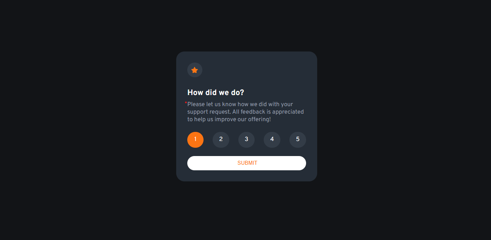
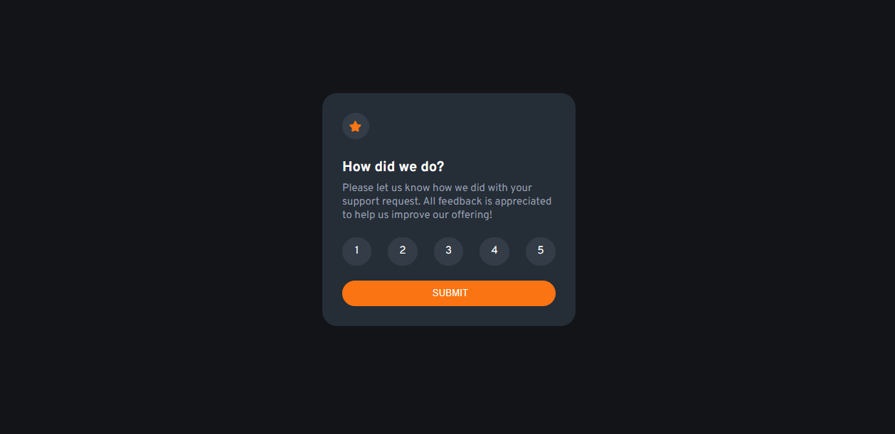
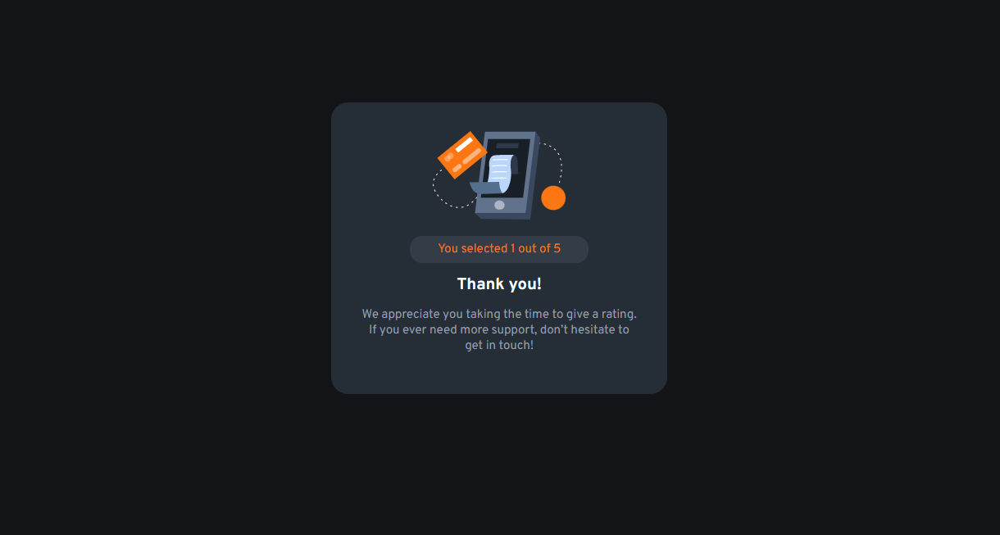
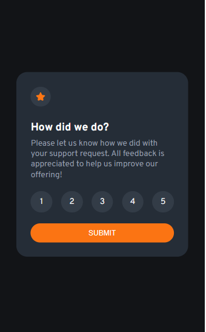
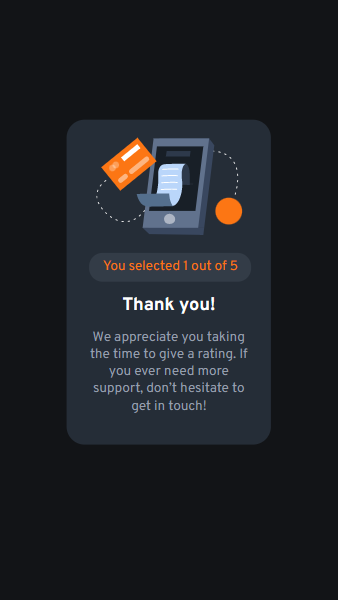

# Frontend Mentor - Interactive rating component solution

This is a solution to the [Interactive rating component challenge on Frontend Mentor](https://www.frontendmentor.io/challenges/interactive-rating-component-koxpeBUmI). Frontend Mentor challenges help you improve your coding skills by building realistic projects. 

## Table of contents

- [Overview](#overview)
  - [The challenge](#the-challenge)
  - [Screenshot](#screenshot)
  - [Links](#links)
- [My process](#my-process)
  - [Built with](#built-with)
  - [What I learned](#what-i-learned)
  - [Useful resources](#useful-resources)
- [Author](#author)

**Note: Delete this note and update the table of contents based on what sections you keep.**

## Overview
  The task was to built a webpage that allows you to give a rating. It then goes on to inform you on the rating you gave and show appreciation.

### The challenge

Users should be able to:

- View the optimal layout for the app depending on their device's screen size
- See hover states for all interactive elements on the page
- Select and submit a number rating
- See the "Thank you" card state after submitting a rating

### Screenshot







### Links

- Solution URL: [https://github.com/NanaAmoanu/nanaamoanu.github.io]
- Live Site URL: [https://nanaamoanu.github.io/interactive-rating/]

## My process

### Built with

- Semantic HTML5 markup
- CSS custom properties
- Flexbox
- [jquery ui](https://jqueryui.com)

### What I learned

I learnt how to store content in local storage and use it on another web page


```js

    $("").click(function(){
        localStorage.setItem("first parameter","second parameter");
        window.location.href="url of page to load";
    })

    $("").html(localStorage.getItem("first parameter"));

```

### Useful resources

- [Haritha Computer and Technology] - This is an amazing Youtube channel which helped understand how to access and use local storage in jquery

## Author

- Caleb Mensah Afful (Nana Amoanu)
- Frontend Mentor - [@NanaAmoanu](https://www.frontendmentor.io/profile/NanaAmoanu)
- Twitter - [@_nana_amoanu](https://www.twitter.com/_nana_amoanu)
- Github - [@NanaAmoanu](https://www.github.com/NanaAmoanu)
