# Frontend Mentor - Multi-step form solution

This is a solution to the [Multi-step form challenge on Frontend Mentor](https://www.frontendmentor.io/challenges/multistep-form-YVAnSdqQBJ). Frontend Mentor challenges help you improve your coding skills by building realistic projects. 

## Table of contents

- [Overview](#overview)
  - [The challenge](#the-challenge)
  - [Screenshot](#screenshot)
  - [Links](#links)
- [My process](#my-process)
  - [Built with](#built-with)
  - [What I learned](#what-i-learned)
- [Author](#author)

## Overview

### The challenge

Users should be able to:

- Complete each step of the sequence
- See a summary of their selections on the final step and confirm their order
- View the optimal layout for the interface depending on their device's screen size
- See hover and focus states for all interactive elements on the page

### Screenshot

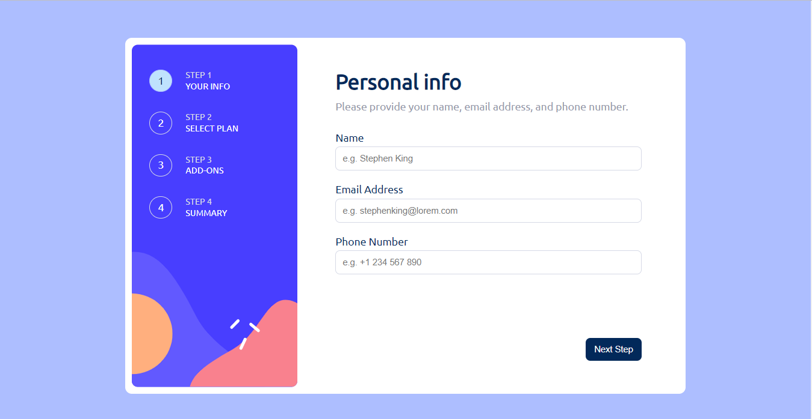
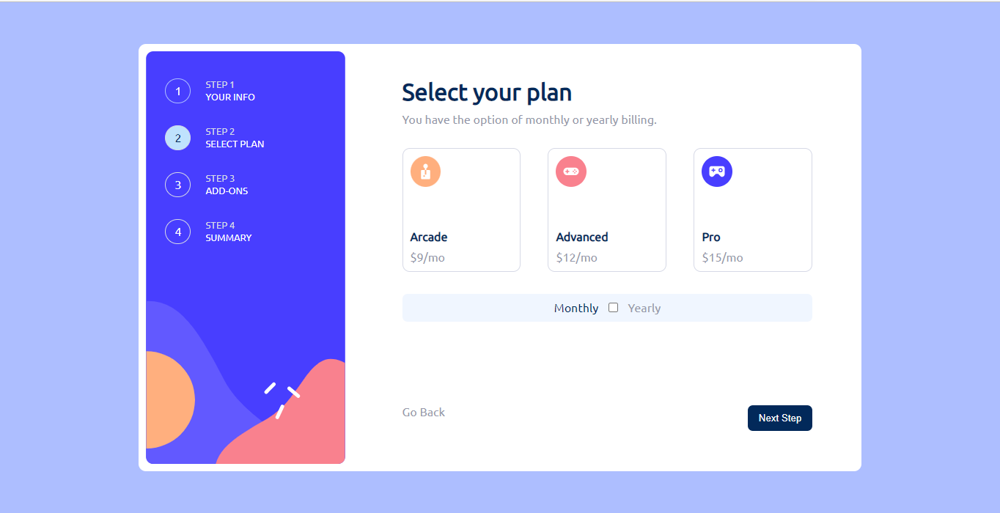
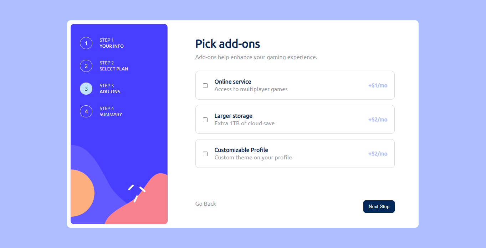
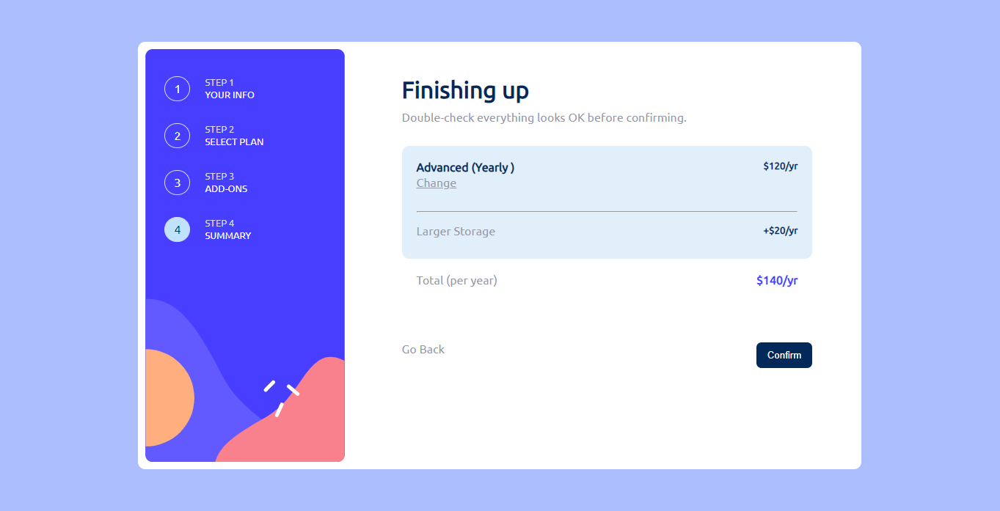
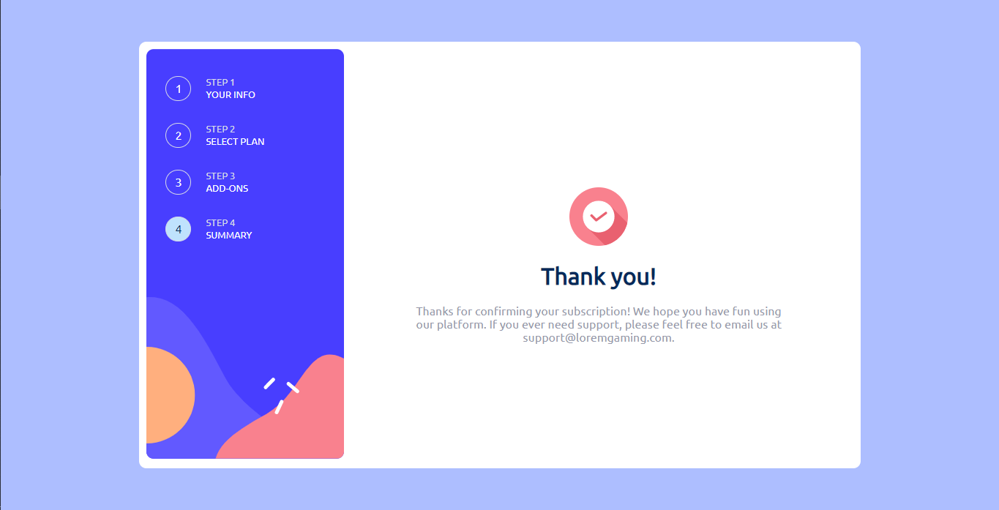
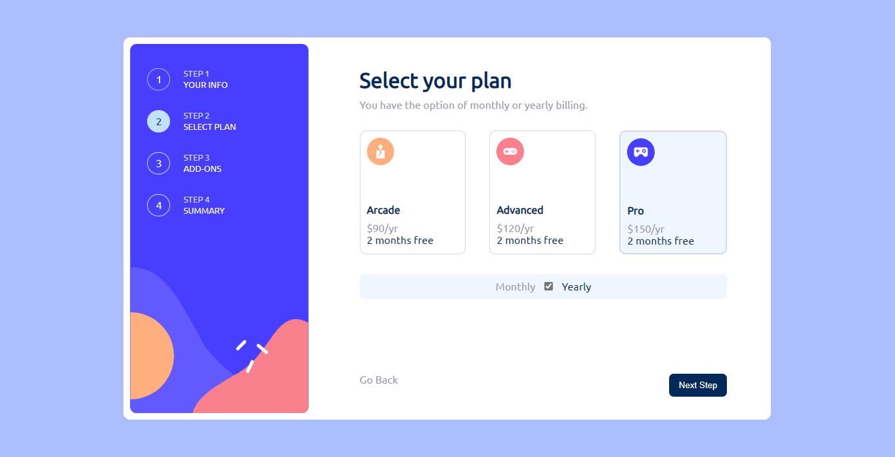
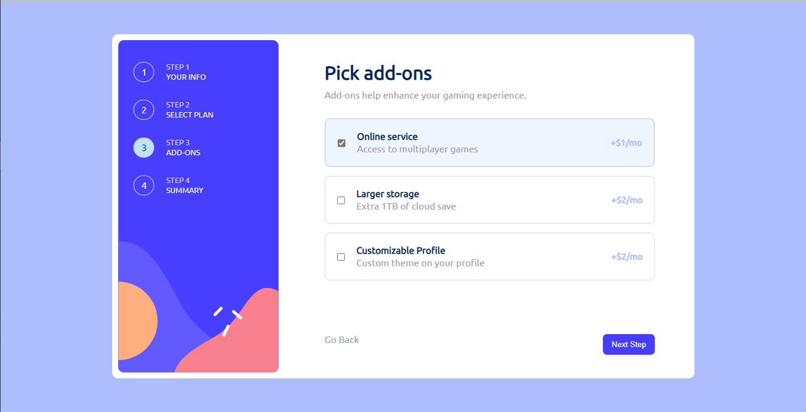
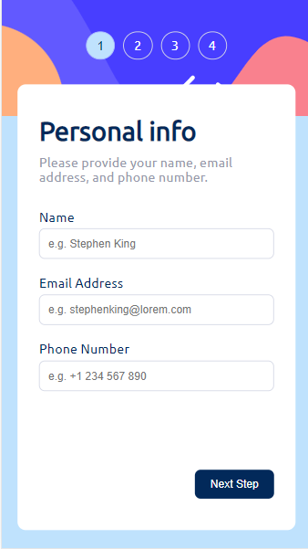
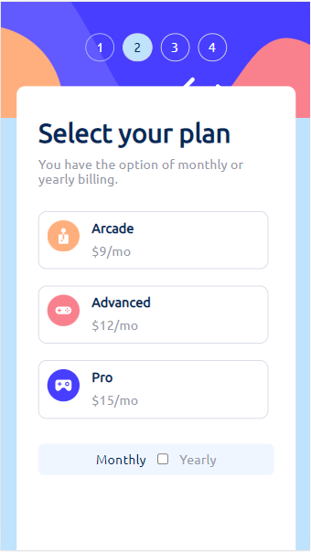
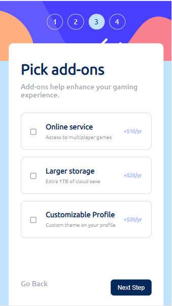
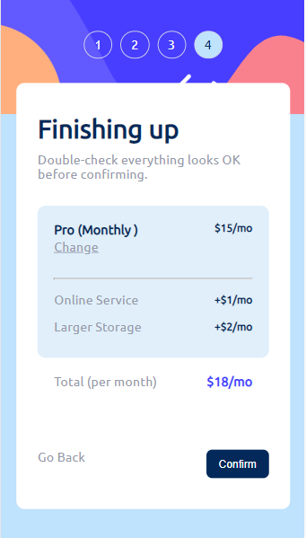

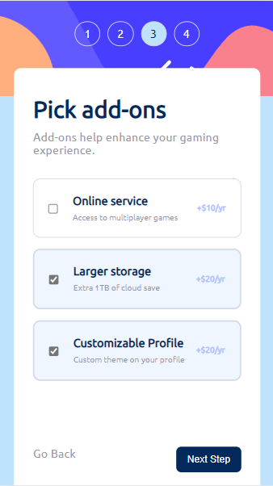

### Links

- Solution URL: [https://github.com/NanaAmoanu/nanaamoanu.github.io]
- Live Site URL: [https://nanaamoanu.github.io/multi-step-form/]

## My process

### Built with

- Semantic HTML5 markup
- CSS custom properties
- Flexbox
- Mobile-first workflow
- [jquery ui](https://jqueryui.com)

### What I learned

This has been an interesting project for me. It gave me the avenue to apply several things I have learnt in front end web development so far. Making use of local storage, accessing specific css attributes and properties and using them to make decisions, using user input in processing information etc.

```js

localStorage.setItem("variable to store data in",assigned_variable);
window.location.href="webpage to send the stored data";
localStorage.getItem("name of variable data was stored in in previous webpage");

```
## Author

- Caleb Mensah Afful (Nana Amoanu)
- Frontend Mentor - [@NanaAmoanu](https://www.frontendmentor.io/profile/NanaAmoanu)
- Twitter - [@_nana_amoanu](https://www.twitter.com/_nana_amoanu)
- Github - [@NanaAmoanu](https://www.github.com/NanaAmoanu)