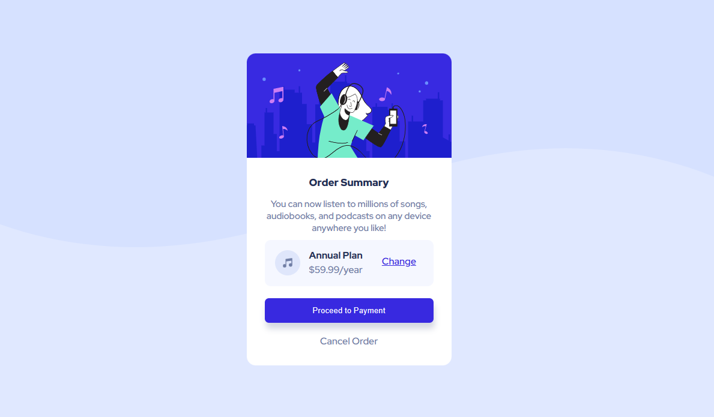

# Frontend Mentor - Order summary card solution

This is a solution to the [Order summary card challenge on Frontend Mentor](https://www.frontendmentor.io/challenges/order-summary-component-QlPmajDUj). Frontend Mentor challenges help you improve your coding skills by building realistic projects. 

## Table of contents

- [Overview](#overview)
  - [The challenge](#the-challenge)
  - [Screenshot](#screenshot)
  - [Links](#links)
- [My process](#my-process)
  - [Built with](#built-with)
- [Author](#author)

## Overview
  The task was to built an order summary webpage that is responsive to various device sizes

### The challenge

Users should be able to:

- See hover states for interactive elements

### Screenshot

### Links

- Solution URL: [https://github.com/NanaAmoanu/nanaamoanu.github.io]
- Live Site URL: [https://nanaamoanu.github.io/order-summary/]

## My process

### Built with

- Semantic HTML5 markup
- CSS custom properties
- Flexbox

## Author

- Caleb Mensah Afful (Nana Amoanu)
- Frontend Mentor - [@NanaAmoanu](https://www.frontendmentor.io/profile/NanaAmoanu)
- Twitter - [@_nana_amoanu](https://www.twitter.com/_nana_amoanu)
- Github - [@NanaAmoanu](https://www.github.com/NanaAmoanu)
